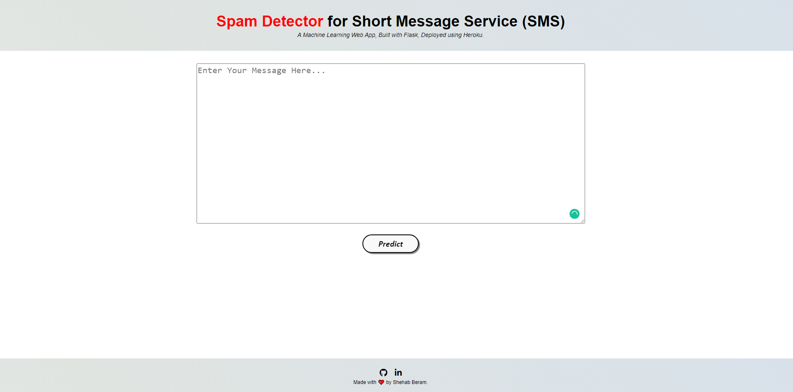

# Spam SMS Classification
  

• A web application that utilizes machine learning to detect/classify SMS messages into SPAM or HAM (normal) based on the textual data using Natural Language Processing.

• A glimpse of the web app:

